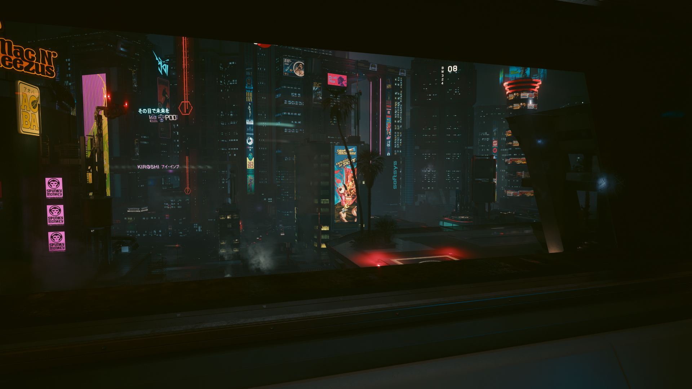

## 🌴 CS Student (UG) · Thinker · Builder

I'm a UG CS student doing web development and diving into AI/ML stuff.

- **Languages:** C, Rust, JavaScript, Python
- **Interests:** Web dev & design, Math & Physics, NixOS & nix-pkgs
- **Vibes:** Building stuff, gaming, travel, trekking 🌴🥰
- **Discord:** @rohitvince0

---

### Window View 🪟

---

### 🔗 Current Projects

| | |
|---|---|
| 📦 **[T-Browser-Extension](https://github.com/Rohit-48/T-Browseee)**   A browser extension project | 📦 **[CyberComponent](https://github.com/Rohit-48/cybercompo)**   A cybercomponent project |

**🐧 [My NixOS Rice](https://github.com/Rohit-48/My-Config)**
